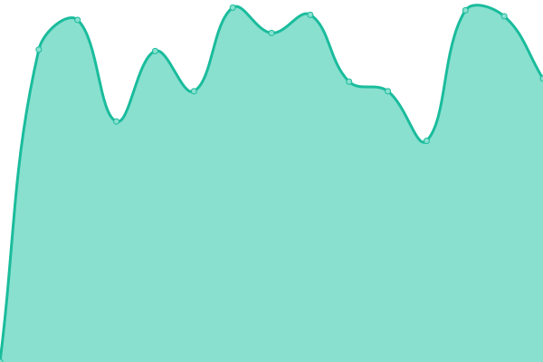
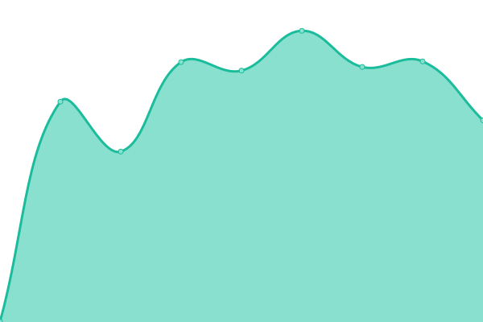

# [📈 Live Status](https://upptime.github.io/upptime): <!--live status--> **🟩 All systems operational**

This repository contains the open-source uptime monitor and status page for [Upptime](https://upptime.js.org), powered by [Upptime](https://github.com/upptime/upptime).

With [Upptime](https://upptime.js.org), you can get your own unlimited and free uptime monitor and status page, powered entirely by a GitHub repository. We use [Issues](https://github.com/upptime/upptime/issues) as incident reports, [Actions](https://github.com/studiovlijmscherp/upptime/actions) as uptime monitors, and [Pages](https://upptime.github.io/upptime) for the status page.

<!--start: status pages-->
<!-- This summary is generated by Upptime (https://github.com/upptime/upptime) -->
<!-- Do not edit this manually, your changes will be overwritten -->
<!-- prettier-ignore -->
| URL | Status | History | Response Time | Uptime |
| --- | ------ | ------- | ------------- | ------ |
|  [Beefs and Beers](https://beefsandbeers.com) | 🟩 Up | [beefs-and-beers.yml](https://github.com/studiovlijmscherp/uptime/commits/HEAD/history/beefs-and-beers.yml) | 

 1961ms
     
 | 

<a href="https://studiovlijmscherp.github.io/uptime/history/beefs-and-beers">87.71%</a>
    

|  [Moodstudios](https://moodstudios.nl) | 🟩 Up | [moodstudios.yml](https://github.com/studiovlijmscherp/uptime/commits/HEAD/history/moodstudios.yml) | 

 1024ms
     
 | 

<a href="https://studiovlijmscherp.github.io/uptime/history/moodstudios">100.00%</a>
    

|  [Nijwa](https://nijwa.nl) | 🟩 Up | [nijwa.yml](https://github.com/studiovlijmscherp/uptime/commits/HEAD/history/nijwa.yml) | 

 1482ms
     
 | 

<a href="https://studiovlijmscherp.github.io/uptime/history/nijwa">100.00%</a>
    

|  [Bluekens](https://bluekenstruckenbus.nl) | 🟩 Up | [bluekens.yml](https://github.com/studiovlijmscherp/uptime/commits/HEAD/history/bluekens.yml) | 

 807ms
     
 | 

<a href="https://studiovlijmscherp.github.io/uptime/history/bluekens">100.00%</a>
    

|  [Lightronics](https://www.lightronics.nl) | 🟩 Up | [lightronics.yml](https://github.com/studiovlijmscherp/uptime/commits/HEAD/history/lightronics.yml) | 

 912ms
     
 | 

<a href="https://studiovlijmscherp.github.io/uptime/history/lightronics">100.00%</a>
    

|  [Bluekens Emailwall N8N](https://wat.verzameldwerk.com/webhook/fd953b37-1e7e-4fde-9008-cd19f39d1e5d) | 🟩 Up | [bluekens-emailwall-n8-n.yml](https://github.com/studiovlijmscherp/uptime/commits/HEAD/history/bluekens-emailwall-n8-n.yml) | 

 560ms
     
 | 

<a href="https://studiovlijmscherp.github.io/uptime/history/bluekens-emailwall-n8-n">99.77%</a>
    

<!--end: status pages-->

[**Visit our status website →**](https://upptime.github.io/upptime)

## 📄 License

- Powered by: [Upptime](https://github.com/upptime/upptime)
- Code: [MIT](./LICENSE) © [Upptime](https://upptime.js.org)
- Data in the `./history` directory: [Open Database License](https://opendatacommons.org/licenses/odbl/1-0/)
